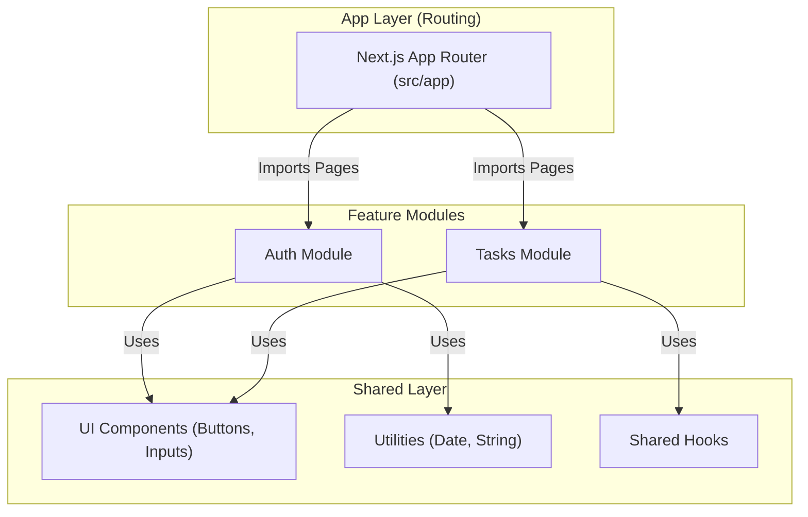
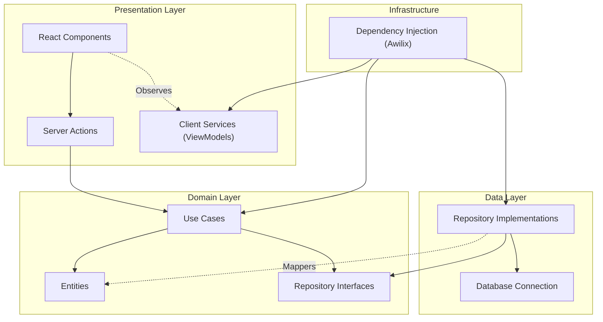

# Task Manager

A simple Task Manager (TODO app) project built with Next.js, TypeScript, Tailwind CSS, and Clean Architecture.

## Features

- **Authentication**: Register and Login (JWT-based).
- **Task Management**
  - Create, Read, Update, Delete tasks.
  - **Task Status**: Todo, In Progress, Done.
  - **Due Dates**: Set due dates for tasks with expired status indication.
- **Clean Architecture**: Separation of concerns (Domain, Data, Presentation).
- **Dependency Injection**: Managed by Awilix for server side and client side.
- **Dockerized**
  - **Database**: PostgreSQL running in Docker (via Colima).
  - **DevContainer**: Fully configured development environment.

## Prerequisites

- **Docker**: Docker Desktop or Colima (for macOS).
- **VSCode** (for DevContainer support).
  - **Remote - Containers** VS Code Extension (if using DevContainer).
- **Node.js 22+** (if running locally without DevContainer).
- **Make** (for running convenience commands).

### Tech Stack

- **Framework**: Next.js 16.1.0
- **Language**: TypeScript
- **Styling**: Tailwind CSS
- **Database**: PostgreSQL 15 (Alpine)
- **Validation**: Zod
- **Auth**: JWT (Jose)
- **DI**: Awilix
- **Testing**: Jest

## Getting Started

There's two ways to run this project: using a **DevContainer** (recommended for a consistent environment) or **Locally** with Docker Compose.

### Development Workflow & Tools

This project uses `Makefile` to simplify common development tasks.

### Option A: Using DevContainer (Recommended)

This approach isolates the development environment, all dependencies and extensions are pre-configured.

1. **Open the Project in VS Code**.
2. Install Containers plugin » [https://marketplace.visualstudio.com/items?itemName=ms-vscode-remote.remote-containers]()
3. **Reopen in Container**:
   - Open the Command Palette (`Cmd+Shift+P` or `Ctrl+Shift+P`).
   - Type and select **"Dev Containers: Reopen in Container"**.
4. **Wait for Initialization**:
   - VS Code will build the container, install dependencies, and set up the database.
5. **Run the Application**:
   - Open the integrated terminal in VS Code.
   - Run the development server:
     ```bash
     make dev
     ```
   - The app will be available at [http://localhost:3000](http://localhost:3000).

### Option B: Local Environment & Docker Compose

If you prefer to run Node.js locally and only use Docker for the database. Makesure your Node.js environment already installed.

1. **Initialize Docker Environment**

   - **Option 1: macOS with Colima, use colima, if not installed, then install view homebrew: `brew colima`.**
     ```bash
     make init  # Starts Colima
     ```
   - **Option 2: Docker Desktop**: Ensure Docker Desktop is running.
2. **Start Database**:

   ```bash
   make up
   ```

   This starts the PostgreSQL container.
3. **Install Dependencies**:

   ```bash
   make install
   ```
4. **Apply Migrations**:

   ```bash
   make migrate-up
   ```
5. **Run Development Server**:

   ```bash
   make dev
   ```

   The app will be available at [http://localhost:3000](http://localhost:3000).

### Database & Migrations

This project provide by a custom scripts to manage SQL migrations.

- **Create a new migration**:

  ```bash
  make migration NAME=create_users_table
  ```

  This creates `.up.sql` and `.down.sql` files in the `migrations/` directory. You can write your query there.
- **Apply pending migrations**:

  ```bash
  make migrate-up
  ```
- **Rollback last migration**:

  ```bash
  make migrate-down
  ```
- **Database Access**:

  - **Host**: `localhost`
  - **Port**: `5433` (exposed on host) / `5432` (internal)
  - **User**: `admin`
  - **Password**: `password`
  - **Database**: `task_manager`

### Testing & Coverage

We use **Jest** for testing.

- **Run all tests**:

  ```bash
  make test
  ```

  This command runs all unit and integration tests and **automatically collects code coverage**.
- **Check Coverage**:

  - After running `make test`, coverage reports are generated in the `coverage/` folder.
  - Open `coverage/lcov-report/index.html` in your browser to view a detailed visual report.
  - **Coverage Threshold**: The project use a global coverage threshold of **80%**.

### Linting

- **Run Linter**:

  ```bash
  make lint
  ```

  This checks for code style issues using ESLint.

## System Architecture & Scalability

This project implement **Clean Architecture** principles, adapted for a **Modular Mini-App** strategy. This is to acommodate a scalable approach as the application grows, make it maintainable, testable, and scalable.

### 1. High-Level Layers

The application is divided into three main layers, as commong clean architecture:

1. **Domain Layer** (Inner): Business logic, Entities, and Use Cases. (Pure TypeScript, No Frameworks).
2. **Data Layer** (Outer): Repositories, Database connections, and External APIs.
3. **Presentation Layer** (Outer): UI (React), Server Actions, and REST APIs.

### 2. Modular "Mini-App" Strategy

To scale beyond, we adopt a **Vertical Slice** architecture. Ideally, each major feature (for example: Tasks, Auth, Transaction, Billing, Profile, etc) is treated as a standalone "Mini-App".

### Before: Current Structure

```
src/
├── __tests__/             # Unit and Integration Tests
├── app/                   # Next.js App Router (Presentation Layer)
│   ├── (auth)/            # Authentication Routes (Login, Register)
│   ├── api/               # API Routes (e.g., Status Check)
│   ├── components/        # UI Components
│   └── tasks/             # Task Management Routes
├── data/                  # Data Layer (Repositories, DB Connection)
├── domain/                # Domain Layer (Entities, Use Cases, Interfaces)
├── hooks/                 # Custom React Hooks
├── locales/               # Internationalization Files
├── presentation/          # Presentation Layer Logic
│   └── actions/           # Server Actions
└── services/
    └── container.ts       # DI Container Configuration
scripts/
└── migrate.ts             # Migration Runner
migrations/                # SQL Migration Files
middleware.ts              # Auth Middleware
```

### After: Target Modular Structure

**Target Structure for Scaled Development:**
Each module should encapsulate its own Data, Domain, Presentation, and DI configuration. The `src/app` folder remains thin, to achive this, we do a vertical scaling around the modules, and left the app acting only as a router.

```
src/
├── app/                 # Routing Layer (Next.js App Router)
│   ├── (auth)/          # Maps URL routes to Module Components
│   └── tasks/           # e.g. /tasks -> renders TasksModule.ListPage
├── modules/             # Feature Modules (Vertical Slices)
│   ├── auth/
│   │   ├── domain/      # Auth Entities & Use Cases
│   │   ├── data/        # Auth Repositories
│   │   ├── presentation/# Auth Actions & Components
│   │   ├── locales/     # Module-specific Translations
│   │   └── container.ts # Auth DI Module
│   ├── tasks/
│   │   ├── domain/ 
│   │   ├── data/ 
│   │   ├── presentation/ 
│   │   ├── locales/ 
│   │   └── container.ts 
│   └── shared/          # Shared Kernel (UI Kit, Utilities)
│       ├── hooks/       # Shared Hooks
│       └── ui/          # Shared Components
scripts/ 
└── migrate.ts           # Migration Runner 
migrations/              # SQL Migration Files 
middleware.ts            # Auth Middleware 
```

*For simplicity in this demo, layers are grouped globally (`src/domain`, `src/data`), but the code is structured to be easily split into these vertical modules.*

### 3. Module Interaction & Shared Layer

Below is diagram illustrates how the App Router, Feature Modules, and the Shared Layer interact.



### 4. UI Management in Mini-Apps

In the future development, the architecture already support for more scaling which the UI is also sliced vertically. The `src/app` directory (Next.js App Router) acts as the **Routing Layer** that maps URLs to specific Module Components.

**How it works:**

1. **Module Components**: Each module (`src/modules/tasks/presentation/components`) exports "Smart Components" or "Pages".
2. **App Router (`src/app`)**: Simply imports these components and handles routing parameters.
3. **Shared UI**: Atomic design components (Buttons, Inputs) live in `src/shared/ui` or a separate package.

**Example Structure:**

```typescript
// src/modules/tasks/presentation/pages/TaskListPage.tsx
// This component connects to the Task DI Container
export function TaskListPage() {
  const service = useTaskService(); // Uses module-specific DI
  return <TaskList tasks={service.tasks} />;
}

// src/app/tasks/page.tsx
// Next.js Route just renders the Module Page
import { TaskListPage } from '@/modules/tasks/presentation/pages/TaskListPage';

export default function Page() {
  return <TaskListPage />;
}
```

This `src/app` remains thin and purely focused on routing, while the actual UI logic lives inside the feature module.

### 5. Dependency Injection (DI)

This project use **Awilix** to manage dependencies, split into two distinct contexts to respect the **Server (Node.js)** vs **Client (Browser)** boundary.

#### A. Server-Side DI (`src/services/server/server_container.ts`)

* **Scope**: Server Actions, API Routes, Background Jobs.
* **Registers**: Repositories (Data) and Use Cases (Domain).

#### B. Client-Side DI (`src/services/client/client_container.ts`)

* **Scope**: React Components (Browser).
* **Registers**: Client Services (ViewModels) that manage UI state.
* **Pattern**:
* **Service**: A class (e.g., `TaskEditingService`) holding state (`BehaviorSubject` or internal vars) and logic.
* **Context**: A React Context acts only as a **bridge** to provide the Service to the component tree.
* **Component**: Consumes the Service via hooks.
* **Why?** This prevents "Context Hell" and keeps business logic out of UI components, making them easy to test and refactor.

### 6. Dependency Graph



### 7. Future-Proofing: Migrating to Microservices

The benefits of this architecture is the ability to adapt to a **Microservices** backend without rewriting the entire frontend application.

If we decide to split `Data` and `Domain` logic into a separate backend service (e.g., a Go/Rust API):

1. **Domain Layer**: Remains mostly unchanged. The "Use Cases" still define the application's behavior.
2. **Data Layer**: This is the only part that changes.
   **Current**: `TaskRepositoryImpl` queries the database directly (SQL).
   **Future**: `TaskRepositoryImpl` makes HTTP requests to the external Microservice.

**Example Adaptation:**

```typescript
// Current Implementation (Monolith)
class TaskRepositoryImpl implements ITaskRepository {
  async getTasks(): Promise<Task[]> {
    return db.query('SELECT * FROM tasks');
  }
}

// Future Implementation (BFF / Microservices)
class TaskRepositoryImpl implements ITaskRepository {
  async getTasks(): Promise<Task[]> {
    const response = await fetch('https://api.tasks-service.com/v1/tasks');
    return response.json();
  }
}
```

The **Presentation Layer** (UI & Actions) and **Domain Layer** (Use Cases) depend only on the `ITaskRepository` **interface**, those remain completely the unchanged, unaware of this switch. This allows for a seamless transition from Monolith to Microservices.

## Database Schema

The following diagram represents the database schema using **dbdiagram.io** syntax.

```dbdiagram
Table users {
  id uuid [pk, default: `gen_random_uuid()`]
  email varchar(255) [not null, unique]
  password varchar(255) [not null]
  created_at timestamptz [default: `CURRENT_TIMESTAMP`]
  updated_at timestamptz [default: `CURRENT_TIMESTAMP`]
}

Table tasks {
  id uuid [pk, default: `gen_random_uuid()`]
  title varchar(255) [not null]
  description text
  status varchar(50) [not null] // check constraint: 'todo', 'in_progress', 'done'
  user_id uuid [not null]
  due_date timestamptz
  created_at timestamptz [default: `CURRENT_TIMESTAMP`]
  updated_at timestamptz [default: `CURRENT_TIMESTAMP`]

  Indexes {
    user_id [name: "idx_tasks_user_id"]
  }
}

// Relationships
Ref: tasks.user_id > users.id [delete: cascade]
```

## Deployment

The application is containerized using Docker, making it easy to deploy to any platform that supports containers (AWS ECS, DigitalOcean App Platform, Google Cloud Run, etc.).

### 1. Build the Docker Image

```bash
docker build -t task-manager .
```

### 2. Run the Container

```bash
docker run -p 3000:3000 \
  -e DATABASE_URL="postgresql://..." \
  -e JWT_SECRET="secret" \
  task-manager
```

## Application Walkthrough

Screenshot of the application provided in the [screenshot directory](./screenshot).
